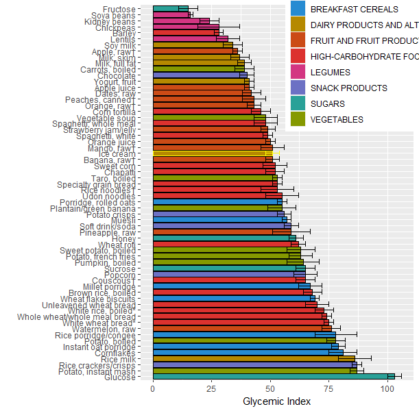

## Glycemic Index Graph

The purpose of this markdown is to create a graph of the glycemic index of some common foods, and highlight that ice cream has a pretty good glycemic index, especially for how delicious it is.

This was inspired by articles in The Atlantic (<https://www.theatlantic.com/magazine/archive/2023/05/ice-cream-bad-for-you-health-study/673487/>) and uses data from Harvard, so fancy: <https://www.health.harvard.edu/diseases-and-conditions/glycemic-index-and-glycemic-load-for-100-foods>

